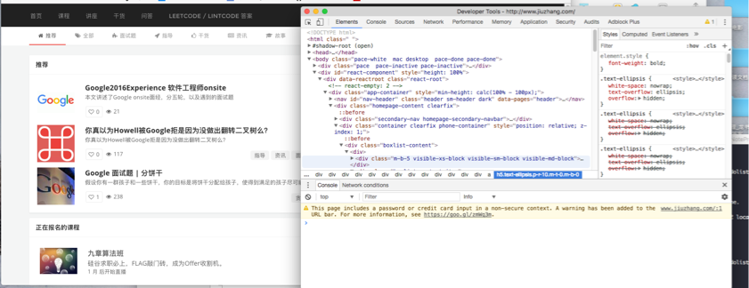
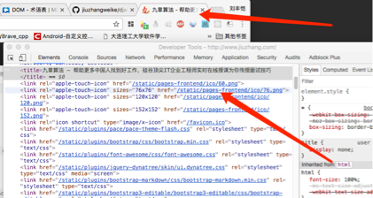
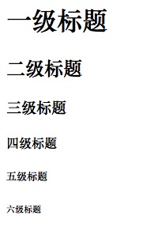
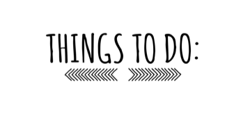

# 从零开始的 Web 开发教程


## 简单的 HTML 知识

**HTML** 是 Web 系统设计的基石，几十年间 Web 开发的技术栈迭代过了无数的次数，但 HTML 的变化相对的就小的多，不过 HTML本身相对比较简单，我们可以用短短几分钟就可以学会这些知识。

HTML 的全称是 **HyperText Markup Language** ，超文本标记语言，从这个标记语言的名字上来看 HTML 本质上和我们学习过的程序语言是有本质的不同的，程序语言负责通过一系列的语句程序完成一系列程序操作，但标记语言我们可以简单理解为 **通过一种格式化的标签的方式描述信息**。相比于程序语言的众多 `Corner Case` 语句相比，标记语言结构较为简单（这意味着写 Parser 也相对容易，(逃)），这也是程序语言表意化的一种成果。

我们在日常使用网站中会经常见到各种的 HTML 文本：



（如图我们在 **九章** 的首页中右键使用，显示网页源代码或者是使用检查功能都能看到对应的 **HTML** 文本）

上图中的 HTML 看起来本身有点复杂，那是因为本身这个本身就是一个较为复杂网站，我们从开始不需要去处理那么多复杂的东西。

### Hello World

我们多做少说，先来引入一个最简单的 `Hello World` 的 HTML 代码：

``` html
<!DOCTYPE html>
<html lang="en">
<head>
    <meta charset="UTF-8">
    <title>Title</title>
</head>
<body>
<p> Hello World </p>
</body>
</html>
```

通过观察这段代码，我们发现 HTML 的文本格式确实比较简单，一个元素包含一组**对称的带有尖括号的标签** （并不是完全如此），另外每个标签对之间可以包含内容（如字符串什么的），还可以包含下一层标签对，还有就是有的标签的里面还有带有类似赋值语句的东西，这是在设置这个标签对的具体属性。

HTML 着实很简单，我们刚才并没有使用任何引经据典的讲述，就仅通过观察发现了 HTML 的很多核心的内容：

* 标签（包含有尖括号对的标签和单个的标签）
* 属性（我们刚才看到的属性）
* 基于字符的数据类型、字符引用和实体引用（填在便签里面的内容）

除此之外我们注意到第一行中有这样子的一个标签字样 `<!DOCTYPE html>`，这里提一句，这个标签是为了让浏览器能正确识别出我们这个文件是一个 HTML 的文本文件。`<html></html>` 中间的内容代表 HTML 的代码，但 `<body></body>` 对中的内容才是真正显示在屏幕中的内容。

### 练习：Hello World

``` shell
git checkout "chapter-one-zero-to-web-practice"
```

打开 `src/html/hellWorld.html` 文件根据文章和代码提示，完成我们刚才这个超简单的 Hello World 程序，并且使用浏览器预览。不要嫌这个联系简单，不积跬步无以至千里，量级庞大的程序的都是从最简单的程序开始的，几分钟我们就可以完成这个 Task。

### HTML 的结构和简单语法

我们从刚才对 HTML 的源码的分析，我们能够看出我们的 HTML 本质上实际上是一种 **树形** 结构，我们把每个标签想象成一个节点，包含标签的标签就可以被理解成是一个父节点。事实上我们对 HTML 的理解没有问题，由 HTML 的组成的树形结构被称作 **DOM树** ，而浏览器的渲染不过就是对树进行各种的遍历然后绘制到用户能够使用的界面中去，当然我们也可以实用程序来操作这些 **DOM节点** ，当然这是后话，我们在之后会降到这些操作。


（上图就是 DOM 树的简单结构，我们看到是由不同的 Element 组成的，每个 Element 还可以有自己的 Atrribute）

> 拓展阅读： 关于 DOM 树的更多知识
>
> * [W3C HTML DOM 教程](http://www.w3school.com.cn/htmldom/)
> * [Mozilla 上的 DOM 相关](https://developer.mozilla.org/zh-CN/docs/Glossary/DOM)
>
> 无论是 **W3C** 还是 **Mozilla** 都是很好的 Web 程序开发文档，但是因为本身就像是字典一样的东西，所以不建议逐个的那么学习，而是遇到什么不会的知识有针对性的去查询和学习。

在对 HTML 进行分析之后我们还是延续之前的讲授思路，只想在之后我们需要使用的东西，更多的知识有 **W3C** 那样的字典网站可以方便的查询和了解。

#### head 头结点标签

``` html
<head>
    <title>Title</title>
</head>
```

我们在头结点里面插入一个 title 标签，这个就能显示在浏览器的每个标签页中的标题上。



（如图，九章算法首页的标题和 title 标签的实现）

#### 层级标签

HTML标题由 `<h1>` 到 `<h6>` 六个标签构成，字体由大到小递减：

``` html
<h1>一级标题</h1>
<h2>二级标题</h2>
<h3>三级标题</h3>
<h4>四级标题</h4>
<h5>五级标题</h5>
<h6>六级标题</h6>
```



#### 超链接

``` html
<a href="http://www.jiuzhang.com/">九章算法 - 帮助更多中国人找到好工作，硅谷顶尖IT企业工程师实时在线授课为你传授面试技巧</a>
```

我们可以通过简单的 **<a** 标签并通过 **href** 属性设置点击之后的超链接，并在标签之中添加超链接的文字。

#### 列表

我们要开发一个 **Todo-List** 应用，那么就要去展示全部的列表项目，我们就要使用标签中的列表标签：

``` html
<ul>
  <li>咖啡</li>
  <li>茶</li>
  <li>牛奶</li>
</ul>
```

这是无序列表，会被渲染成如下的样子：

* 咖啡
* 茶
* 牛奶

``` html
<ol>
  <li>咖啡</li>
  <li>牛奶</li>
  <li>茶</li>
</ol>

<ol start="50">
  <li>咖啡</li>
  <li>牛奶</li>
  <li>茶</li>
</ol>
```

这个就是有序列表，会被渲染成如下的样子，并且可以依赖属性控制开始的项目

1. 咖啡
2. 牛奶
3. 茶

（start from 50）

50. 咖啡
51. 牛奶
52. 茶

#### 图片

当然我们也能够在项目中添加相应的图片，这时候只需要使用 **** 标签：

``` html

```



我们使用  的 **src** 属性这样就可以在列表中插入一张图片，其中 **static** 是存放图片的路径。

### 练习：简单标签的使用

仍使用 `chapter-one-zero-to-web-practice` 分支中的工程文件中的 `src/html/tagTest.html` 文件，在文件中根据注释使用以上介绍的这些标签，以上介绍的标签并不全面，根据我们的原则我们现在只需要做出来成果的刚刚好的只是就好啦。HTML 包含为数众多的标签，但是其实我们平时能用上的标签并不多，并且很多标签都是要靠我们自己修改样式。

