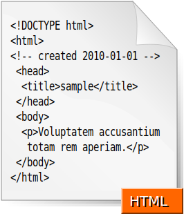

# 从零开始的 Web 开发教程

## 简单的 CSS 知识

经过我们上面的练习，我们应该都已经掌握了 **HTML** 的大概的使用方法，并且已经熟悉了其中一些主要的标签，那我们就可以向着更多的知识去进发。我们之前使用了不少的 **HTML** 标签，也做过了一些练习，但是仅有这些东西我们明显还是不够的哦，仅有这些默认样式我们没办法创造出缤纷多彩的网站样式。

我们在标签中也能使用

但是我们刚才也讲到了面对这样一个以树为模型的文本，我们能操纵的方法就多种多样了。

## 简单的 JavaScript 知识

## 设计我们的 Todo-List

## 一个人的全栈

##  