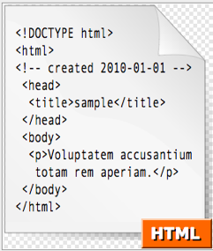
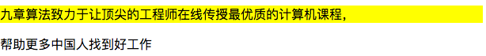

# 从零开始的 Web 开发教程


## 简单的 CSS 知识

经过我们上面的练习，我们应该都已经掌握了 **HTML** 的大概的使用方法，并且已经熟悉了其中一些主要的标签，那我们就可以向着更多的知识去进发。我们之前使用了不少的 **HTML** 标签，也做过了一些练习，但是仅有这些东西我们明显还是不够的哦，仅有这些默认样式我们没办法创造出缤纷多彩的网站样式。



我们在之前的程序中已经使用过了标签的属性，如 `` 标签的 **src** 属性既可以设置一个图片标签的图片，**background-color** 属性可以设置背景颜色。但是同时我们也意识到了另一个问题，如果我们的网页中有大量的同质的标签使用，难道我们还需要对每个标签都做一个这样的操作么？这明显是一个不现实的想法，而且具体操作起来也实在是太麻烦了。

这时候我们需要的就是有一种方法，能快速的从我们的 HTML 中获取我们所需要的一个或是具有同种类型的一组标签，并且一次性针对所有选出来的标签进行操作。刚才也讲到了面对这样一个以树为模型的文本，我们能操纵的方法本身就多种多样，这种技术在 **CSS** 中被称为 **CSS选择器** ，CSS 中主要支持五种选择器，通过这五种选择器，我们能从各个角度来获取所需要的节点。

CSS 指的是 **Cascading Style Sheets** 即层叠样式表，我们在 **HTML5** 中开始实现了标签和样式的分离，我们使用 HTML 编写标签，而用 **CSS** 编写样式，我们可以使用 `<style>` 标签在代码中包含我们的样式代码，也可以通过这样的方式引入整个样式文件：

``` html
<style rel="stylesheet" href="/static/css/bootstrap.min.css">
```

### 选择器

这里面我先介绍几种简单的选择器：

#### 类选择器

``` html
<p class="lfkdsk">九章算法致力于让顶尖的工程师在线传授最优质的计算机课程，帮助更多中国人找到好工作</p>
```

我们为这个文本段添加类选择器：

``` css
.lfkdsk {
	background-color:yellow;
}
```

类选择器的语法就如上文所示，我们能通过这个选择出所有 *class* 属性是 **lfkdsk** 的标签，并将它们的背景变成黄色。


#### ID 选择器

``` html
<p id="lfkdsk">九章算法致力于让顶尖的工程师在线传授最优质的计算机课程，</p>
<p>帮助更多中国人找到好工作</p>
```

比如我们有很多并列的标签，但是我们不想要设置 `class` 的 ID，只想要选中某个 id 的指定的标签，我们可以这么添加代码：

``` css
#lfkdsk { 
	background-color:yellow;
}
```

我们仅仅把对应 ID 的标签的背景颜色设为了黄色了。



#### 标签选择器

我们当然还有另一种选择，我们可以批量的选取某一种类的标签，让所有的这种标签都能应用上类似的属性：

``` html
<p>九章算法致力于让顶尖的工程师在线传授最优质的计算机课程，</p>
<p>帮助更多中国人找到好工作</p>
```

还是这个例子但是如果我们需要他们都被设置成黄色：

``` css
p { 
	background-color:yellow;
}
```

除此之外标签选择器还有很多类似的语法：

* 组合：

``` css
p,div {
  
}
<!-- 这样能选择所有的 P 和 Div 块 -->
```

* 所有子元素：

``` css
div p {
  <!-- 这样能选择 DIV 元素中所有的 P 元素-->
}
```

* 所有某种父元素的某种子元素：

``` css
div > p {
    <!-- 选择父元素为 <div> 元素的所有 <p> 元素 -->
}
```

* 并列元素：

``` css
div + p {
    <!-- 选择紧接在 <div> 元素之后的所有 <p> 元素 -->
}
```

> 拓展阅读：CSS 选择器
>
> 我们这里面只介绍了三种比较基础的 CSS 选择器，我实际开发中使用到的 Selector 会比这个多，
>
> 读者应该阅读 [CSS选择器](http://www.w3school.com.cn/cssref/css_selectors.ASP) 获取更多的知识。

#### 练习：选择器

切换分支到 `chapter-one-zero-to-web-practice` 中，使用 `src/css/selector.css` 中设置不同的选择器，让 HTML 中的所有元素都加上高量（可以试着使用很多种方式实现这个过程）。

### 盒模型

**CSS** 中还有另一个比较重要的东西控制了 HTML 中位置和样式的 盒模型，如下图所示：


HTML 文档中的每个元素都被描绘成矩形盒子，这些矩形盒子通过一个模型来描述其占用空间，这个模型称为盒模型。盒模型通过四个边界来描述：margin（外边距），border（边框），padding（内边距），content（内容区域）。这四种类型的属性整体构成我们的盒模型。

那我们在计算盒模型大小的时候就不能单单的只计算我们为元素所设的大小，而是要考虑到 内边距、外边距、边框的宽高。

我们举这样的一个例子，盒模型中间填充内容是一个div块，我们把这个div的样式设定为这个样子：

``` css
div {
    width: 300px;
    border: 25px solid green;
    padding: 25px;
    margin: 25px;
}
```

我们的盒子模型的实际宽度应该是什么那？

应该是 element-width + left-border + right-border + left-padding + right-padding + left-margin + right-margin = 

300px(元素大小)

50px (左 + 右填充)

50px (左 + 右边框)

50px (左 + 右边距) = 450px

#### 计算大小

最终元素的总宽度计算公式是这样的：

总元素的宽度=宽度+左填充+右填充+左边框+右边框+左边距+右边距

元素的总高度最终计算公式是这样的：

总元素的高度=高度+顶部填充+底部填充+上边框+下边框+上边距+下边距

#### 新的属性 

随着 Web 开发的不断发展，人们慢慢的意识到传统的盒子模型不直接，CSS 添加了新的属性 `box-sizing:`。当你设置一个元素为 `box-sizing: border-box;` 时，此元素的内边距和边框不再会增加它的宽度。

``` css
div {
    width: 300px;
    border: 25px solid green;
    padding: 25px;
    margin: 25px;
}
```

还是这个例子，我们的div块就不会变成 450px 大小，而是仍能保持我们的整体的块大小为 300px，大小什么的会往内部去找，而不是靠内元素撑开。

> 拓展阅读：CSS 的属性
>
> CSS 之中可讲的知识点并没有很多，我们更多的是在熟悉和掌握更多的常见的 CSS 属性，
>
> [CSS 知识](http://www.w3school.com.cn/css/index.asp) 我们可以通过阅读 W3C 获取和 CSS 相关的更多知识，可以试试运行其中的各种实例，
>
> 加深对 CSS 的理解。

## 了解 Bootstrap

