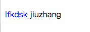
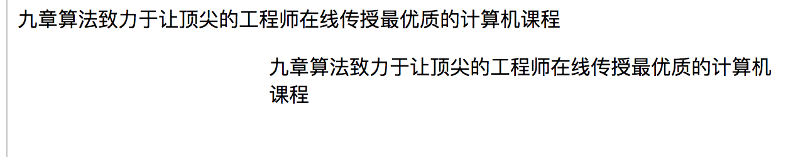
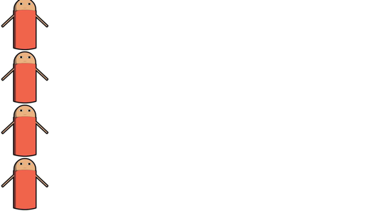
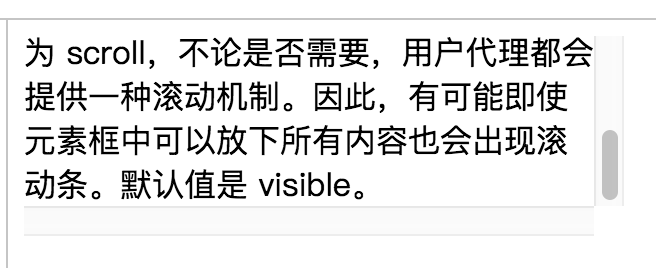

### CSS 样式 Demo

我们在上一节中已经简单的了解了一些和 CSS Selector 相关的部分知识，接着在这一节中我们会见到一些简单的例子，通过一些简单的例子，去实践更多的 CSS 属性，我们可以学到一些和 CSS 样式设计有关系的知识。

#### 部分文字设置颜色：

在一群文字同时排列的时候，我们可能只需要其中的一部分文字拥有高亮的效果，就像我们经常在代码段中见到的那样部分的关键字和符号有高亮而其余的文字高亮。

``` html
<p><span class="highlight"> lfkdsk </span> jiuzhang </p>
```

我们通过 span 作为行内元素，再为这个行内元素设置自己的 class ，然后设置 CSS 样式就能实现行内的颜色高亮。

``` css
span.highlight {
  color:rgb(0,0,255) 
}
```

最后显示的样式是这样子：



我们全部的代码是这个样子的：

``` html
<html>
<head>
<style type="text/css">
span.highlight {color:rgb(0,0,255)}
</style>
</head>

<body>
<p><span class="highlight"> lfkdsk </span> jiuzhang </p>
</body>
</html>
```

#### 设置外边距：

我们目前并没有系统介绍过盒模型相关的知识，这部分进阶知识我们会在之后的拓展部分进行推荐阅读。我们可以简单的理解我们每个元素都有内边距、外边距，简单的来讲内边距挤占内部的空间，外边距控制了和其他元素之间的关系：

``` html
<html>
<head>
<style type="text/css">
p.leftmargin {margin-left: 200px}
</style>
</head>

<body>
<p>九章算法致力于让顶尖的工程师在线传授最优质的计算机课程</p>
<p class="leftmargin">九章算法致力于让顶尖的工程师在线传授最优质的计算机课程</p>
</body>
</html>
```

运行这些代码，我们能看到明显的左边距的效果：



#### 背景垂直重复：

我们经常有需要为某种背景设置背景，因为本身是使用小图进行设置，那我们就需要一种重复机制进行设置，比如让图片纵向重复平铺，或者让背景纵向平铺。我们可以通过 `background-repeat` 这个属性对它进行设置：

``` html
<html>
<head>

<style type="text/css">
body
{ 
background-image: 
url(http://img5.imgtn.bdimg.com/it/u=3894097359,3266263308&fm=26&gp=0.jpg);
background-repeat: repeat-y
}
</style>
</head>
<body>
</body>
</html>

```

我们设置为整个 body 都被一张图片在 y 轴上重复填充。

保存运行之后的效果是：




#### 使用滚动条来显示溢出的内容：

当我们开发带有列表的程序时，我们不希望内容的逐渐填充把页面撑得很大，而是希望我们的界面能提供一个滚动条，能让我们的内容能够滚动的浏览，就如同我们接下来要开发的这个 Todo-List 界面，我们就需要为我们的 todo 项目提供一个列表。这时候我们就为我们所想要设置滚动条的元素为固定大小，这时候依赖属性 `overflow: scroll;` 进行设置，内部元素大小超过的时候，就能显示出滚动条：

``` html
<html>
<head>
<style type="text/css">
div 
{
width:300px;
height:100px;
overflow: scroll;
}
</style>
</head>
<body>
<div>
如果元素中的内容超出了给定的宽度和高度属性，overflow 属性可以确定是否显示滚动条等行为。这个属性定义溢出元素内容区的内容会如何处理。如果值为 scroll，不论是否需要，用户代理都会提供一种滚动机制。因此，有可能即使元素框中可以放下所有内容也会出现滚动条。默认值是 visible。
</div>
</body>
</html>
```

最后显示出来的效果如下图所示：



