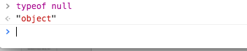

# 从零开始的 Web 开发教程


## 简单的 JavaScript 

我们之间介绍了作为网页设计元素基石的 **HTML** 和负责为其添加样式的 **CSS** ，但是在这里我们明显发现，只有这些我们能写出来的网页都是静态的网页，我们虽然有元素、有样式，但是我们的网页本身是不可变的，这就让人不是很开心了，我们平时使用的网站都是有大量的效果和变化的网站，还能实现各种前台和后台的数据的交互，这就不是单单使用这两种语义化的标记性语言能够完成的了。

因而在 Web 开发中我们需要一种能够提供更多功能，修改网页中的元素的一种语言，又因为网页使用广泛、要求快速上线、快速部署的功能我们需要一种易于开发的动态语言，因此 JavaScript 这门语言就应运而生了。坦率的说 JavaScript 并不是一门设计非常精良的语言，语言的开发者只用了很短的时间开发了这门语言，因而这门语言在上个世纪的应用看起来混乱不堪，但是随着标准 **ECMAScript** 的不断发展，JavaScript 越来越趋于规范化，在最近更新的 ES6、ES7 ，我们逐渐的见到了 JavaScript 中混乱的东西在逐渐的消失，新的特性支持趋于完善。

### 基础入门

作为一门微课，我们不应该在课程中讲解语言的细节，所以推荐对 JavaScript 还没有了解的同学，可以去阅读廖雪峰老师的 [JavaScript课程](http://www.liaoxuefeng.com/wiki/001434446689867b27157e896e74d51a89c25cc8b43bdb3000) ，廖老师的很多讲解还是面向零基础的、严谨而详细的。

如果对现代化的程序设计语言有一定了解，那么 JavaScript 对你就并不困难，目前很多开发语言正在逐渐的同质化，多种语言拥有相似相通的设计风格，基本上使用 30 分钟左右就可以阅读完推荐课程的基础部分，这里我们应该说一些重点的、容易误解、经常出问题的 JavaScript 语法细节。

###  动态类型

**ECMAScript** （ JavaScript 的执行标准 ）中有五种简单的数据类型：

* Undefined
* Null
* Boolean
* Number
* String

还有另一种是一种复杂结构 Object ，就如同 JVM 也只支持少量的数据类型一样的，我们通过各种数据结构的组合就能表示无数种的对象，更何况 JavaScript 中的数据对象本身也拥有动态性所以也不需要更多的数据结构了。

这里面有一些需要讲解的地方，比如：

*  `Undefined` 类型是未定类型，有声明未初始化的对象都会被设置为 `undefined` ，但是未声明的变量其实也会出现这种情况：

``` javascript
var lfkdsk
// var lfk 未定义数据类型
console.log(lfkdsk)
console.log(lfk)
```

在严格模式下：


我们会发现这会导致一个引用错误，但是如果不启用严格模式，会输出两个 `undefined` ，需要注意这种情况。

* `Null` 类型，null 类型本身是一个 object：

``` javascript
typeof null;
```



本身 null 是一个 值为 null 的 object 的对象，这个设计本身就很奇怪，但是这个问题其实来自于很久以前的浏览器实现问题的一种勉强手段。所以我们用到的一些判断，就不能依赖与 object 的判断来进行了，因为即使是 null 的东西也都会被判断为 object。

* `NaN` 非数值（Not A Number）:

Number 数值计算中还有一个特殊的数据对象叫做 `NaN`  指的是非数值，是指没办法被转型成 Number 类型的数据，但是 NaN 也有一些坑：

``` javascript
typeof NaN;
console.log(NaN == NaN);
```

我们会发现：


额，我们的 **NaN** 是一个 `Number` ，但是那个 **NaN** 居然不等于 **NaN** 自己，这真是 233333，但是库函数中我们还提供了一个函数用来判断是不是一个 *非数值* —— `isNaN()` ，但是其实在这个函数行为中也有更多的问题，我们可以一并讨论一下：

``` javascript
console.log(isNaN(NaN));
console.log(isNaN(10));
console.log(isNaN('10'));
console.log(isNaN('blue'));
console.log(isNaN(true));
```

我们测试这几个函数来看看结果：


仔细观察，`isNaN` 函数的行为本身也有一些问题，里面的 **'10'** 能被转换为 **10** ，所以也不是一个 NaN ，但是我们 **'blue'** 没办法被转换成一个数值，所以是一个非数值，所以说我们根本没办法借助这个方法做出准确的判断，因为所有不是数字的东西，都会返回非数值，即使它根本连个数都不是。

因此如果我们真的想判断一个一个数是不是非数值，我们就应该试着**判断它是否和自身相等**，因为在行为上分析，正常的都会和自己自身相等，只有非数值和自己不相等。

### 原型链 * 

在对 JavaScript 语言中进行一定的了解之后，我们都会难免的涉及到和 **原型链** 相关的知识，并且在一些前端的面试的测试之中，和原型链相关的知识一直是其中的重点。但是，其实本身 `原型` 和 `原型链` 相关的知识都是非常简单的。首先我们知道我们的原型链最大的用来实现的用途是用来实现原型继承的 OOP。在早期的