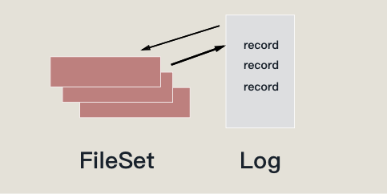
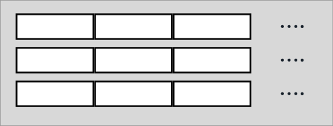
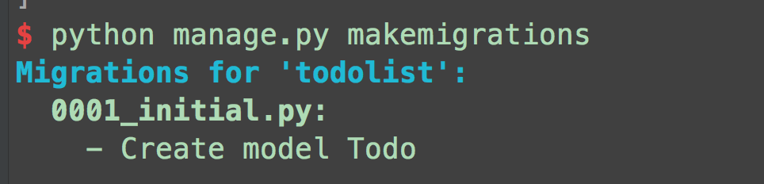
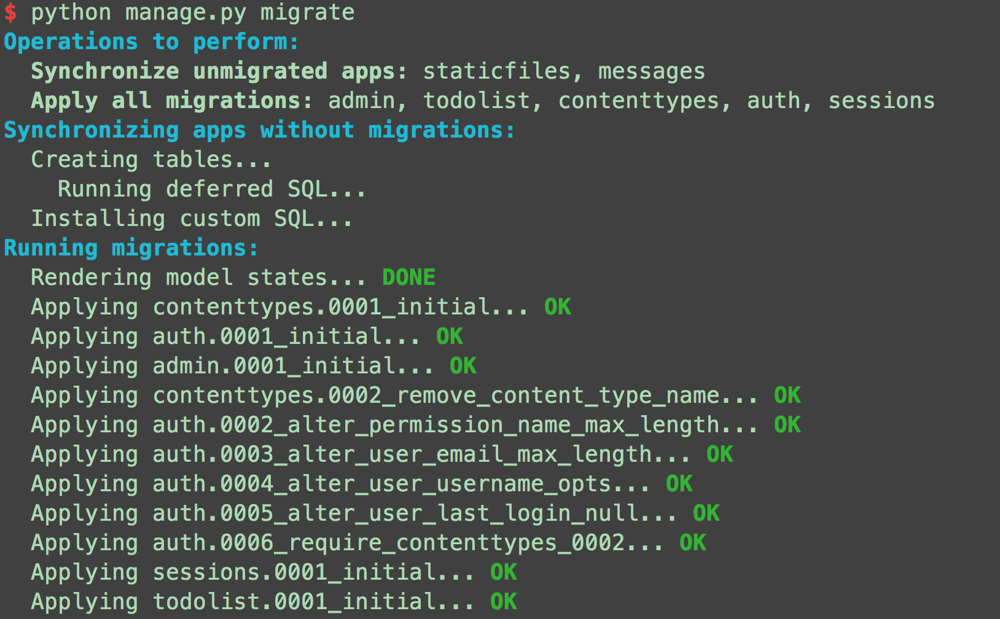

# 来做我们的 Todo-List

太好了，我们终于走到了这一步，不知道我们有多少同学成功的坚持下来了。前面我们分别的学习了 **Django入门开发** 的相关的知识，和 **Web前端开发** 相关的 HTML、CSS以及一些 JavaScript 相关的知识，这些知识虽然看起来较为繁杂，但是在我们一步步的不断地学习之后，大家都对这些部分的知识和内容有了一定的了解，接下来我们终于要开始设计和实现我们所想要制作的 `Todo-List` 程序了。

``` 
├── db.sqlite3
├── manage.py
├── requirements.txt
├── static
│   ├── css
│   │   ├── bootstrap-theme.css
│   │   ├── bootstrap.css
│   ├── fonts
│   │   ├── glyphicons-halflings-regular.eot
│   │   ├── glyphicons-halflings-regular.svg
│   │   ├── glyphicons-halflings-regular.ttf
│   │   ├── glyphicons-halflings-regular.woff
│   │   └── glyphicons-halflings-regular.woff2
│   └── js
│       ├── bootstrap.js
│       ├── bootstrap.min.js
│       ├── jquery-3.2.1.min.js
│       └── npm.js
├── templates
│   ├── base.html
│   └── index.html
└── todolist
    ├── __init__.py
    ├── admin.py
    ├── migrations
    ├── models.py
    ├── settings.py
    ├── urls.py
    ├── views.py
    ├── wsgi.py
```


## 了解数据库

在具体的设计开发之前，我们还应该了解一些与数据库相关的知识，并且这里我们也会把这部分的知识侧重在 Django 中的数据库的使用。在进入我们的介绍之前，我们先提出这样的一个问题，那就是我们常说的数据库到底是什么东西？我们在 [Wikipedia](https://zh.wikipedia.org/wiki/%E6%95%B0%E6%8D%AE%E5%BA%93) 能看到这样的解释：

> [数据库管理系统](https://zh.wikipedia.org/wiki/%E6%95%B0%E6%8D%AE%E5%BA%93%E7%AE%A1%E7%90%86%E7%B3%BB%E7%BB%9F)（英语：Database Management System，简称DBMS）是为管理[数据库](https://zh.wikipedia.org/wiki/%E8%B3%87%E6%96%99%E5%BA%AB)而设计的电脑[软件](https://zh.wikipedia.org/wiki/%E8%BB%9F%E9%AB%94)系统，一般具有存储、截取、安全保障、备份等基础功能。数据库管理系统可以依据它所支持的[数据库模型](https://zh.wikipedia.org/w/index.php?title=%E8%B3%87%E6%96%99%E5%BA%AB%E6%A8%A1%E5%9E%8B&action=edit&redlink=1)来作分类，例如[关系式](https://zh.wikipedia.org/wiki/%E9%97%9C%E8%81%AF%E6%A8%A1%E5%9E%8B)、[XML](https://zh.wikipedia.org/w/index.php?title=XML%E8%B3%87%E6%96%99%E5%BA%AB&action=edit&redlink=1)；或依据所支持的电脑类型来作分类，例如服务器群集、移动电话；或依据所用查询语言来作分类，例如[SQL](https://zh.wikipedia.org/wiki/SQL)、[XQuery](https://zh.wikipedia.org/w/index.php?title=XQuery&action=edit&redlink=1)；或依据性能冲量重点来作分类，例如最大规模、最高运行速度；亦或其他的分类方式。不论使用哪种分类方式，一些DBMS能够跨类别，例如，同时支持多种查询语言。

无论我们作为什么方向的软件开发者，我们都或多或少的会用到各种形式上的数据库，但是这种细分领域的东西是很容易让人困惑和畏惧的东西，比如数据库、编译器和操作系统等等的大型系统，都会让人有望而生畏的情绪，但是我们这里应该暂时放下这种情绪，让我们简单的来考虑我们的数据库的本质到底是什么。

我们这里可以给出一种简单的结论——**数据库本质上是一系列文件的集合，是文件系统和事务的组合** 。如果我们从这个角度来考虑，数据库就不是什么复杂的东西了，我们可以简单地使用这样的一副图片来表示我们的理解：



这里我们看到我把数据库分成了两堆，一部分是 `FileSet` 用于数据库实际内容的存储，我们可以简单地把他想成 Json 或是 XML 那种结构化的数据存储方式，通过不断地 append 操作不断地拓展和扩充我们的文件堆（当然实际上文件的存储是通过写入二进制文件的方式来进行的）。另外的一部分我们称之为 Log （日志），我们对数据库的每一种数据操作都会添加一条记录在 Log 日志中，那我们为什么除了存储用文件之外我们还需要 Log ？ 这就是说我们的数据库我们需要实现一些其他的操作，就是增删改查之外，我们还能对这些操作进行 “回滚” 的操作，也就是将已经写入的数据进行撤回。这就是我们 Log 存在的原因。


## 数据库设计

我们在上面的一个章节中简单的介绍了所谓的 “数据库（database）”  到底是怎样的一种东西，想必读者对其中的某些概念也有一些的困惑，但是不要紧，对于这种的东西的实现，我们只需要放下对数据库的畏惧了解到所谓数据库是文件系统的一种增强形式的设计。那么我们存储在数据库中的数据到底是怎样的一种形式呢？我们可以简单地用一幅图来表示：



我们的数据库其实就是这样的一个大的表格，其中的每一个 Item 就是表格的一行，每一列都是一种属性，从这样的一种角度去解释，数据库的存储实现看起来更像是一个 Excel 软件一样的东西，有一个大大的表格，横行表示一条数据，纵行表示其中的一种属性。这样我们对数据库存储的理解就更为清楚了。总而言之，从上层的应用来看，我们的数据库也不过是用起来像 Excel 表格，存起来像文件一样的东西罢了。

我们总算是对数据库系统的原理有了我们自己的见解，这种了解和见解，目前看起来可能比较简单，但是会对我们的使用和理解有很大的帮助。我们在开发实际的程序之前我们应该简单的设计一下我们的程序，首先是数据设计，我们只是为了实现一个简单的能够存储 每个 Todo-Item 数据而已，因而我们所需要的数据也不过是几种数据：

- 我们需要每个 Item 的 Title 作为每个 Todo-Item 的标题，我们还应该需要一个 description 值来对我们的每个 Item 进行更为详细的描述。
- 另外我们的每一个 Item 还需要用一个 Flag 来记录我们当前条目的状态，就是说我们的这条 todo 是不是已经完成了，通过区分这个我们可以提供一些视觉上的区分方法，来区分我们的 todo 是否完成（比如说给已经完成的条目添加删除线）。
- 紧接着我们应该提供一个 createAt 时间戳来记录我们的本条 todo 的创建时间，还有我们还需要一个 updateAt 的时间戳来记录我们更新的时间。

由此我们应该在应用 `todolist` 的 `model.py` 文件中写下如下的代码：

``` python
from django.db import models

class Todo(models.Model):
    title = models.CharField(max_length=255)
    description = models.TextField(blank=True)
    completed = models.BooleanField(default=False)
    created_at = models.DateTimeField(auto_now_add=True)
    updated_at = models.DateTimeField(auto_now=True)
```

引入了 django.db 的 models ，并且让我们所要实现的数据库集成这个类，并且将我们刚才已经讨论出来的结果的属性存储，作为我们类的属性，这样子我们就能定义一个包含这些属性的类。

### 使用 models

我们虽然能够定义了这样的一个数据类去控制我们和这个模板所对应的一个数据类，但是只是这样我们还不能使用这个数据库，还要告诉我们的程序能找到这个数据库，并且为整个程序提供这个数据库，我们就要在 `setting.py` 文件中安装包含有 `models.py` 文件的应用：

``` python
INSTALLED_APPS = [
    #...
    'todolist',
    #...
]
```

然后我们在根目录运行两条命令就可以生成出我们所需要的数据库：

``` shell
$ python manager.py makemigrations
```

使用这条命令我们可以对我们的 `model` 进行操作，无论是添加一个 Field 或者是删除一个 Model 都可以通过这条命令来修改，运行完这个命令之后我们应该会看到这样的结果输出：



在生成修改之后我们可以通过：

``` shell
$ python manager.py migrate
```

我们通过这条命令就能把我们刚才产生的修改应用到我们的数据库中，我们在运行这句话之后应该能看到对应的产生：



我们将我们定义的数据库类，生成出对应的 SQL 并且应用，我们就会获得我们产生的数据库 `db.sqlite3` 文件。

### Model 中的属性 Field

在刚刚的数据类中，我们遇到了很多的子属性，代表了其中的多种的数据类：

``` python
    title = models.CharField(max_length=255)
    description = models.TextField(blank=True)
    completed = models.BooleanField(default=False)
    created_at = models.DateTimeField(auto_now_add=True)
    updated_at = models.DateTimeField(auto_now=True)
```

我们使用 `models` 中提供的各种数据类型的方法创建了不同的属性，另外我们在每个函数中传入了一些 **Field** 中的一些约束，比如说我们在上面的代码中用到的那些：

* `max_length` : CharField 和其子类都需要设定一个最大的长度。
* `blank` : 允许数据为空白，默认是 False
* `default` ：default 值设置了当前属性的默认值，比如这里我们把 `completed` 的值设置为默认是未完成的 False
* `auto_now` ：取当前的时间戳，当当前对象被 saved 的时候，使用最后一次修改的时间戳作为这个 DataTimeField 的值。
* `auto_now_add` : 只取出我们的 Model 第一次创建时当时的时间戳，作为 DataTimeField 的值。

另外我们创建的每个 Model 都会有默认的一个 **id** 属性作为一个自增主键：

``` python
id = models.AutoField(primary_key=True)
```

我们如果不想设置其他的主键来区分 Model ，我们就可以只默认的使用这个 id 作为区分。

### 元数据选项

``` python
from django.db import models

class Todo(models.Model):
    title = models.CharField(max_length=255)
    description = models.TextField(blank=True)
    completed = models.BooleanField(default=False)
    created_at = models.DateTimeField(auto_now_add=True)
    updated_at = models.DateTimeField(auto_now=True)

    class Meta:
        ordering = ('completed', '-updated_at',)
```

我们可以通过 inner class 的方式为我们的 Model 类提供非数据类的额外的数据，Meta Option 给我们提供了多种的属性去控制我们的数据类。

比如我们在这里面使用了 ordering 这个 Meta 属性，这个属性控制了我们获取全部的数据的顺序，ordering 本身接受的是一个元组，里面的每一项都是 Model 的一个 Field，拿到的全部的数据，按照元组中的顺序对我们的数据进行排序。但是这里面出现了一个属性写着 `-updated_at` 的字样比我们的属性多了一个减号，这个的意思是按照降序的方式对数据进行排序。

因此我们上面实际上在做的就是先把所有的数据先按照是否完成来开始排序，然后再按照我们最后的更新时间来继续更新。


## Urls 的设置

``` python
from django.conf.urls import url
from django.contrib import admin
from todolist import views

urlpatterns = [
    url(r'^admin/', admin.site.urls),
    url(r'^$', views.todolist),
    url(r'^delete/(?P<pk>\d+)/', views.delete),
    url(r'^complete/(?P<pk>\d+)/', views.complete),
]
```

我们在之前也介绍过我们使用 Urls 部分的程序设计，我们使用正则表达式去对 `urls` 进行捕获。从我们上面的代码来看，我们支持了这样几个 Action / 路由：

* 默认的 admin 管理界面
* 打开 todolist 的主界面
* 删除一个具体  todo-item 的路由
* 设置某一个具体 todo-item 为完成的路由

这里读者可能会感到比较的意外，为什么我们有完成、有删除但是没有针对 todo-item 的添加呢？

其实是因为我们的这个 Todo-List 的 Demo 中，仅是为了介绍和 Django 的项目，我们尽量减少前端的相关的介绍和操作（或者说是逐步的添加进去），所以说我们这里只用 Django 自带的最传统的方式，完全通过传递表单和刷新页面的方式对 Todo-List 进行刷新和更新。因此我们这里 todo-item 添加的逻辑就被放到整个主页面的逻辑之中去了。


# 简单的模板语法学习

我们在第一课的时候，简单的获取了一个时间戳就直接通过 `HttpResponse` 返回了简单的字符串，但是我们平时使用的网页可不仅仅只能使用这种简单的字符串组成的网页，我们的网页都有各种丰富功能，提供了各种动态的元素和界面。这时候除了使用一些 JavaScript 的手段（我们打算着眼在 Django的技术上面 ），那么我们就应该简单的学习一些和模板相关的技术。

`模板（template）`  是一种 Django 中提供的一种编写界面的方式，因为我们需要提供网页的动态性，就需要一种方式能生成动态的 HTML 的方式。因此 Django 中的模板就是一种提供在 HTML 中的一种 DSL 语言，提供了一些动态化的语法能动态的控制我们渲染的 HTML 的样式和界面，由后端渲染上界面上去，然后再展示在用户的眼前。

感觉对模板的描述较为抽象的同学可以通过这样的一种思路去理解模板引擎做了一个什么样的事情，读过本教程的同学们应该都有使用过 C、Cpp 这样的 C-Style 的语言，那对其中经常使用的预处理器也不会陌生，预处理器的原理解释起来就是将我们写在 `#define` 中的函数体或是变量进行语法树层次的等价替换，直接填写在源码里。那我们的模板引擎其实也是做了这样的一个事情，接受我们动态接到的数据，生成出对应的 HTML 代码，生成出整张页面发送给用户。


## 配置 Template 路径

我们首先要使用的时候我们需要在 `settings.py` 文件中对我们使用的模板引擎进行配置：

``` python
TEMPLATES = [
    {
        'BACKEND': 'django.template.backends.django.DjangoTemplates',
        'DIRS': [os.path.join(BASE_DIR, 'templates')],
        'APP_DIRS': True,
        'OPTIONS': {
            'context_processors': [
                'django.template.context_processors.debug',
                'django.template.context_processors.request',
                'django.contrib.auth.context_processors.auth',
                'django.contrib.messages.context_processors.messages',
            ],
        },
    },
]
```

这里面我们需要关注的地方不太多，我们选择几个简单的子段进行解释：

* `BACKEND` ：我们在 BACKEND 后端这个字段配置了我们为了模板使用的模板引擎，这里我们使用默认的配置就行了。
* `DIRS`：我们在 DIRS 中配置的是我们模板引擎中处理的模板文件的具体的位置，这里我们设置为根目录下的 `templates` 文件夹。
* `APP_DIRS` : 配置的是模板引擎是否对 APP 内的模板进行处理。

## 模板语法

我们可以通过模板语言中，动态的向我们的网页中插入多种格式化的数据（HTML, XML, CSV等等），在模板中我们可以包含变量，在对我们的模板进行 **求值** 和 **生成界面** 的时候将变量动态的替换进去，另外模板语法还支持使用各种流程控制的 **Tag** 能让我们控制模板生成的流程，我们说了这么多可以简单的来看一下模板的语法具体张成什么样子：

``` django


{{ section.title }}


<h1>{{ section.title }}</h1>


<h2>
  <a href="{{ story.get_absolute_url }}">
    {{ story.headline|upper }}
  </a>
</h2>
<p>{{ story.tease|truncatewords:"100" }}</p>


```

### 使用变量（Variables）

在 Django template 文件中使用变量的方式是这个样子的：

``` django
{{ variables }}
```

左右两侧使用两层大括号包围我们的变量名，在对 template 进行生成 HTML 文件的时候，变量名会被动态的替换为我们传入的值，我们在使用这个变量名的时候的规则和 python 的规则相同，我们还可以使用类似这样的方式：

``` django
{{ variable.attr }}
```

去访问我们传入变量的属性。

### 使用过滤器（Filter）

