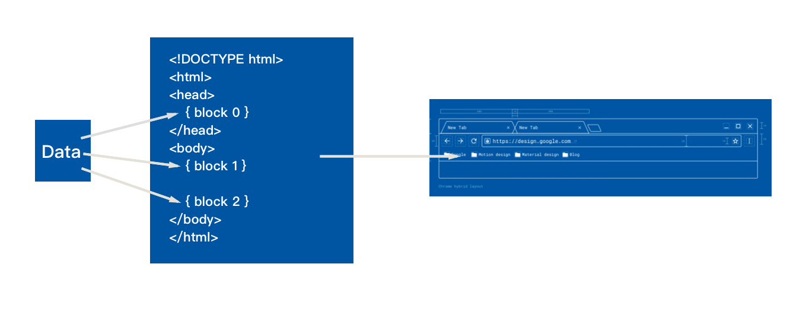

# 简单的模板语法学习

我们在第一课的时候，简单的获取了一个时间戳就直接通过 `HttpResponse` 返回了简单的字符串，但是我们平时使用的网页可不仅仅只能使用这种简单的字符串组成的网页，我们的网页都有各种丰富功能，提供了各种动态的元素和界面。这时候除了使用一些 JavaScript 的手段（我们打算着眼在 Django的技术上面 ），那么我们就应该简单的学习一些和模板相关的技术。

`模板（template）`  是一种 Django 中提供的一种编写界面的方式，因为我们需要提供网页的动态性，就需要一种方式能生成动态的 HTML 的方式。因此 Django 中的模板就是一种提供在 HTML 中的一种 DSL 语言，提供了一些动态化的语法能动态的控制我们渲染的 HTML 的样式和界面，由后端渲染上界面上去，然后再展示在用户的眼前。

感觉对模板的描述较为抽象的同学可以通过这样的一种思路去理解模板引擎做了一个什么样的事情，读过本教程的同学们应该都有使用过 C、Cpp 这样的 C-Style 的语言，那对其中经常使用的预处理器也不会陌生，预处理器的原理解释起来就是将我们写在 `#define` 中的函数体或是变量进行语法树层次的等价替换，直接填写在源码里。那我们的模板引擎其实也是做了这样的一个事情，接受我们动态接到的数据，生成出对应的 HTML 代码，生成出整张页面发送给用户。



## 配置 Template 路径

我们首先要使用的时候我们需要在 `settings.py` 文件中对我们使用的模板引擎进行配置：

``` python
TEMPLATES = [
    {
        'BACKEND': 'django.template.backends.django.DjangoTemplates',
        'DIRS': [os.path.join(BASE_DIR, 'templates')],
        'APP_DIRS': True,
        'OPTIONS': {
            'context_processors': [
                'django.template.context_processors.debug',
                'django.template.context_processors.request',
                'django.contrib.auth.context_processors.auth',
                'django.contrib.messages.context_processors.messages',
            ],
        },
    },
]
```

这里面我们需要关注的地方不太多，我们选择几个简单的子段进行解释：

* `BACKEND` ：我们在 BACKEND 后端这个字段配置了我们为了模板使用的模板引擎，这里我们使用默认的配置就行了。
* `DIRS`：我们在 DIRS 中配置的是我们模板引擎中处理的模板文件的具体的位置，这里我们设置为根目录下的 `templates` 文件夹。
* `APP_DIRS` : 配置的是模板引擎是否对 APP 内的模板进行处理。

## 模板语法

我们可以通过模板语言中，动态的向我们的网页中插入多种格式化的数据（HTML, XML, CSV等等），在模板中我们可以包含变量，在对我们的模板进行 **求值** 和 **生成界面** 的时候将变量动态的替换进去，另外模板语法还支持使用各种流程控制的 **Tag** 能让我们控制模板生成的流程，我们说了这么多可以简单的来看一下模板的语法具体张成什么样子：

``` django


{{ section.title }}


<h1>{{ section.title }}</h1>


<h2>
  <a href="{{ story.get_absolute_url }}">
    {{ story.headline|upper }}
  </a>
</h2>
<p>{{ story.tease|truncatewords:"100" }}</p>


```

### 使用变量（Variables）

在 Django template 文件中使用变量的方式是这个样子的：

``` django
{{ variables }}
```

左右两侧使用两层大括号包围我们的变量名，在对 template 进行生成 HTML 文件的时候，变量名会被动态的替换为我们传入的值，我们在使用这个变量名的时候的规则和 python 的规则相同，我们还可以使用类似这样的方式：

``` django
{{ variable.attr }}
```

去访问我们传入变量的属性。

我们可以对我们刚才学到的使用的变量应用我们的 **过滤器（Filter）**，我们可以通过应用 Filter 的方式对我们的 variables 进行一些修改，比如我们可以写出这样的代码 `{{ name|lower }}` ，我们通过这样的方式把我们的 name 变量全部转为小写字母的方式展示在界面上。

我们除了能单一的对某个变量应用这个 Filter，我们还可以对一个变量应用多个 Filter，让多个过滤器结成一条过滤器链，对同一个变量运用多个连续的处理：

``` django
{{ text|escape|linebreaks }}
```

我们对 `text` 文本进行编码，然后再将文本中的换行符通过 `linebreak` 转换成 `<p>` 标签。

### 使用标签（Tags）

我们除了使用简单的变量来改变网页中确定的内容，以便于能进行对我们的 Web 页面进行一些动态的生成和修改之外我们还能使用形如 `` 的方式来使用一些 Django Language 标签来进行一些更为高阶的操作。我们可以使用成对的标签开控制我们的逻辑流程。

#### for 循环

我们可以使用 **for** 标签对我们的列表进行一个遍历和迭代：

``` django
<ul>

    <li>{{ athlete.name }}</li>

</ul>
```

比如说我们可以通过这样的语法对我们的 `athlete_list` （作者列表）进行迭代，在 HTML 中生成一个列表。

#### if、elif、else 流程控制

我们可以使用经常在编程语言中的能够使用的 `if elif else` 的这种组合来空着我们的逻辑流程：

``` django

    Number of athletes: {{ athlete_list|length }}

    Athletes should be out of the locker room soon!

    No athletes.

```

如果我们的 `athlete_list` 存在非空，我们打印 `athlete_list` 的长度，否则如果 `athlete_in_locker_room_list` 存在则在 HTML 中插入 **Athletes should be out of the locker room soon! ** 如果这两个分支都没有的话，我们就在 HTML 中插入 **No athletes.** 另外我们要记得我们在 Django Language 中使用的标签都要有开始有封闭，所以我们最后要在结尾跟上 `` 。

#### comments 注释

``` django
{# comments #}
```

Django Template Language 作为一门模板语言，我们也得能在模板中使用 `注释` 的功能，我们只要在一层大括号中跟着 `#` ，就可以使用注释功能。

#### 模板继承

我们接着能接触到了 `Django Template Language ` 语言中最复杂的部分——模板继承的功能，我们能够在模板中定义一个定义一个基础的骨架，然后我们可以在我们的 `骨架` 中定义留出我们定义的 **block** 的位置，然后我们可以通过一个继承这个骨架的模板文件，对我们留空的 **block** 进行出具体的实现，那我们的 block 的具体实现的内容在渲染的时候就会被填充在我们的 `骨架` 模板之中，比如说我们举出我们这个 todo-list 的具体的实现部分的一个文件 `base.html` :

``` django
<!DOCTYPE html>
<html>
<head>
  <title>TodoList</title>
  <link rel="stylesheet" href="/static/css/bootstrap.min.css" />
  <script src="/static/js/jquery-3.2.1.min.js"></script>
  <script src="/static/js/bootstrap.min.js"></script>
</head>
<body>
  <div class="container">
    
    
  </div>
</body>
</html>
```

我们在 `base.html` 中仅仅定义了一些少有的东西，仅仅是实现了我们 HTML 的文件结构，填写了 title 引入了相应的 CSS、JavaScript 的库，我们将所有的 body 的内容都定义在了一个 **block** 中，然后我们在其他的文件进行实现：

``` django



  <div>
    <h1>TodoList</h1>
    <table class="table">
      <thead>
      <tr>
        <th>Title</th>
        <th>Completed</th>
        <th>Delete</th>
      </tr>
      </thead>
      <tbody>
      
        <tr>
          <td>{{ todo.title }}</td>
			...
          </td>
        </tr>
      
      </tbody>
    </table>
	...
  </div>

```

我们略去了其中的一部分代码，我们在这个 `index.html` 里面实现了这个 content 的具体实现功能，并且我们也能看到我们在其中传入了我们全部的 TodoList 的数据，然后使用了一个 **for-tag** 将他们全部循环的打印了出来。
