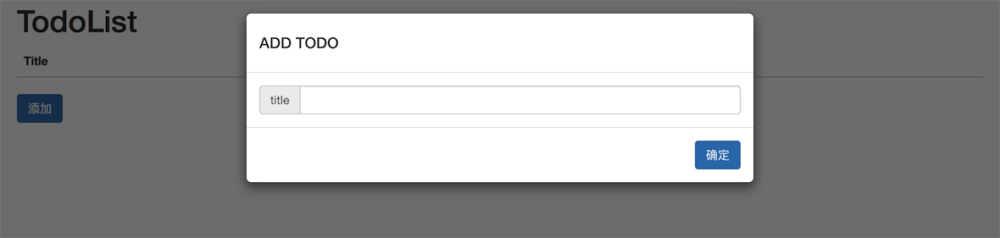
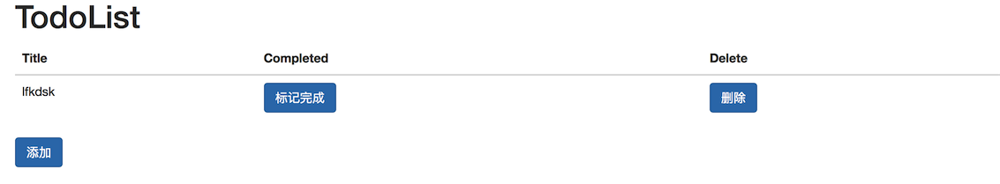

# 其余的一些实现

我们在前面的几个小节中介绍中，我们已经介绍完了至少了大半的程序的内容了，包含了 Url 的捕获、简单的模板引擎的使用、简单的表单提交的知识，并且在这些知识点中我们穿插的介绍了我们的 todo-list 的 Demo 中是如何使用这些知识点进行了相关的实现，其中我们在 `template` 的模板和 `views.py` 的部分的还有一些实现和细节我们还没有完全的介绍清楚，我们在这节里面做一些简要的介绍。

## 使用模态框添加 todo-item

我们在 **todo-list** 的主界面使用弹出模态框的方式添加了 **todo-item**：



如上图所示，我们通过点击弹出一个模态框，我们在模态框里面添写信息，再点击确认上传我们的 **todo-item** ：

``` django
    <div>
      <button class="btn btn-primary" data-toggle="modal" data-target="#modal-add">添加</button>
    </div>
```

我们在界面中放着这样的一个弹出模态框的按钮，能打开一个这样的模态框：

``` django
<div class="modal fade" id="modal-add">
     <form method="post">
        
        <div class="modal-dialog">
          <div class="modal-content">
            <div class="modal-header">
              <h4>ADD TODO</h4>
            </div>
            <div class="modal-body">
              <div class="input-group">
                <span class="input-group-addon">title</span>
                <input type="text" class="form-control" name="title" />
              </div>
            </div>
            <input type="hidden" name="action" value="add" />
            <div class="modal-footer">
              <button class="btn btn-primary" type="submit">确定</button>
            </div>
          </div>
        </div>
     </form>
</div>
```

我们在模态框中包含了一个表单，我们把确定的按钮设置为了 `submit` 我们又通过了设置了一个隐藏的 `<input>` 设置 `action` 为 `add` ，来区分我们的 action，我们点击确定，就能向本页面发送一个表单。

``` python

def todolist(request):
    if request.method == 'POST':
        action = request.POST.get('action')
        if action == 'add':
            title = request.POST.get('title')
            Todo.objects.create(title=title)

    todolist = Todo.objects.all()
    return render(request, 'index.html', locals())

```

我们在本页面的 `Views.py` 界面中检测向本界面提交的表单，并且检测到我们的 `action == 'add'` 然后我们以获取到的数据，向数据库创建新的对象。

然后我们再获取全部的数据库的对象，渲染到我们的页面上面，这就是我们不依赖其他手段，仅通过重新刷新界面的方式进行我们的更新。

## 其余的 Views 中的简单实现 



我们通过对点击完成或是删除都会调用 Views.py 中对应的程序：

``` python
def delete(request, pk):
    todo = get_object_or_404(Todo, id=pk)
    todo.delete()
    return HttpResponseRedirect('/')


def complete(request, pk):
    todo = get_object_or_404(Todo, id=pk)
    todo.completed = True
    todo.save()
    return HttpResponseRedirect('/')
```

这部分的实现也都很是简单，删除或是完成，我们不过是修改状态，或是找到对应的 item 直接删除掉。

## 小结

到这部分位置我们终于几乎仅依赖于 Django 的相关的知识构建了我们自己的 Todo-List 程序，麻雀虽小五脏俱全。但是我们在开发方面的追求是永无止步的，在接下来的章节中，我们会介绍如何使用 Django 以外的其他知识，来不断的完善和美化我们的 Todo-List 程序。